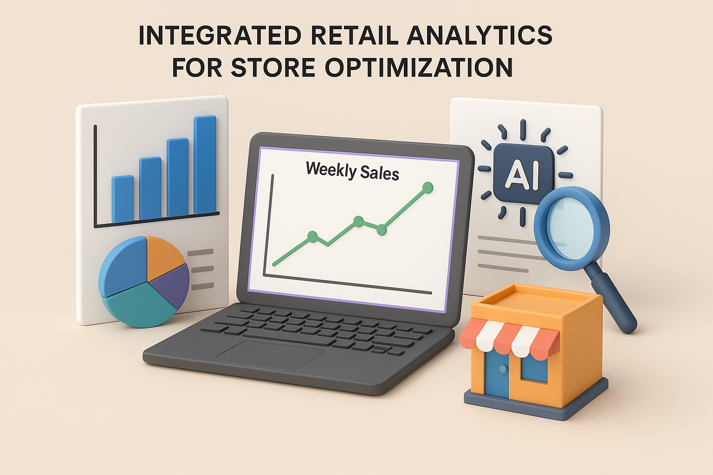

## 

# 🏬 Integrated Retail Analytics for Store Optimization

## 📋 Project Overview

This project analyzes retail data to optimize store performance and forecast weekly sales using data science and machine learning techniques.

---

## 📦 Data Sources

Three CSV datasets are used:

1. **stores-data-set.csv** 🏢

   - Store number, type (A/B/C), and size.

2. **features-data-set.csv** 📈

   - External factors: temperature, fuel price, holidays, markdown offers, CPI, unemployment.

3. **sales-data-set.csv** 💰
   - Weekly sales by store and department, with holiday indicators.

---

## 🛠️ Step-by-Step Process

### 1. Data Loading & Merging 🔗

- Load all three datasets using pandas.
- Merge on `Store` and `Date` to create a unified DataFrame for analysis.

### 2. Data Cleaning 🧹

- **Check for missing values** and visualize with a heatmap.
- **Handle missing values:**
  - Fill `MarkDown1-5` columns with 0 (no offer = 0).
- **Remove duplicates** and **fix data types** (e.g., convert `Date` to datetime, `Type` to category).
- **Sort and reset index** for consistency.

### 3. Exploratory Data Analysis (EDA) 📊

- **Univariate Analysis:**
  - Store type distribution, store size, weekly sales, holiday weeks, fuel price trends.
- **Bivariate Analysis:**
  - Store type vs sales, store size vs sales, sales trends over time, CPI/unemployment vs sales.
- **Multivariate Analysis:**
  - Combined effects of store type, holidays, markdowns, and economic factors.
  - Heatmaps and pairplots for deeper insights.

### 4. Feature Engineering 🏗️

- Extract date features: year, month, week, day, quarter.
- Encode categorical variables (store type).
- Convert `IsHoliday` to integer.
- Create aggregated features: average sales per store, sales per square foot.

### 5. Model Building 🤖

- **Linear Regression:** Baseline model.
- **Random Forest Regressor:** High accuracy, captures complex patterns.
- **XGBoost Regressor:** Strong performance, good for further tuning.

### 6. Model Evaluation & Tuning 🏁

- Evaluate models using R2 Score and RMSE.
- **Hyperparameter tuning** with `RandomizedSearchCV` for Random Forest and XGBoost.
- Visualize actual vs predicted sales (line and scatter plots).
- Summarize results in a comparison table.

### 7. Insights & Recommendations 💡

- Type A stores perform best, especially during holidays.
- Larger stores generally have higher sales.
- MarkDown offers boost sales, especially for Type A/B.
- Economic factors have indirect effects.
- **Recommendation:** Use tuned Random Forest for forecasting, focus on Type A stores, plan markdowns around holidays, and address underperforming departments.

---

## 📈 Results

| Model                     | R2 Score   | RMSE    |
| ------------------------- | ---------- | ------- |
| Linear Regression         | 0.6895     | 12,776  |
| Random Forest (Untuned)   | 0.9987     | 818     |
| **Random Forest (Tuned)** | **0.9988** | **802** |
| XGBoost (Untuned)         | 0.9945     | 1,707   |
| XGBoost (Tuned)           | 0.9946     | 1,683   |

---

## 🚀 How to Run

1. Clone the repo and install requirements.
2. Place the datasets in the `data/` folder.
3. Open and run the Jupyter notebook:  
   `Integrated_Retail_Analytics_for_Store_Optimization.ipynb`

---

## 🔗 GitHub Repository

[Project Repository](https://github.com/dipankarmajumdar/Integrated-Retail-Analytics-for-Store-Optimization)

---

## 📝 Conclusion

This project demonstrates how data-driven analytics and machine learning can optimize retail operations and sales forecasting, providing actionable insights for business growth.
